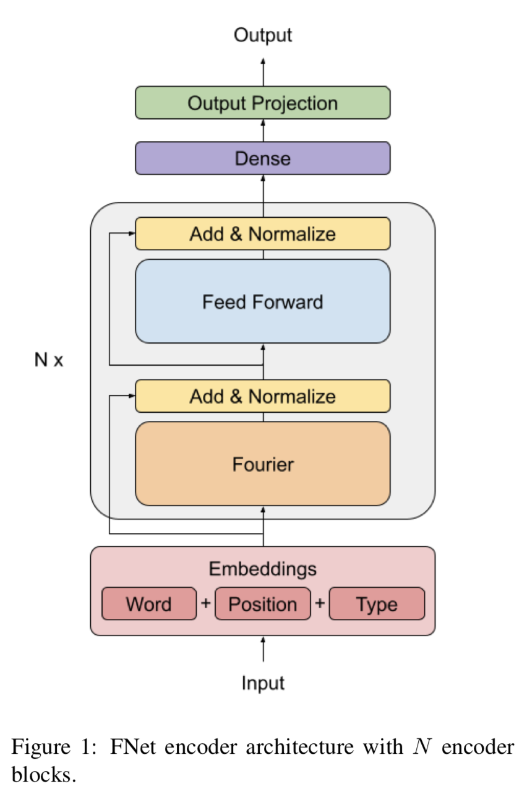

# FNet-tensorflow
Tensorflow Implementation of [FNet: Mixing Tokens with Fourier Transforms](https://arxiv.org/pdf/2105.03824.pdf).


## Citation:
```
@misc{leethorp2021fnet,
      title={FNet: Mixing Tokens with Fourier Transforms}, 
      author={James Lee-Thorp and Joshua Ainslie and Ilya Eckstein and Santiago Ontanon},
      year={2021},
      eprint={2105.03824},
      archivePrefix={arXiv},
      primaryClass={cs.CL}
}
```
